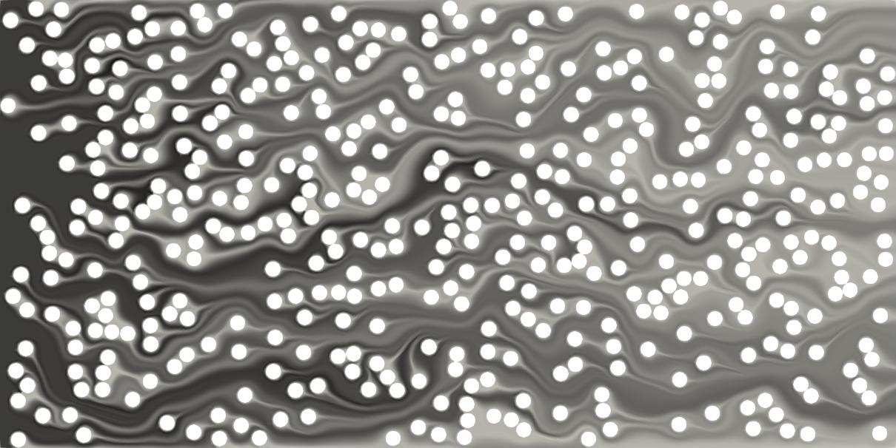

# ClotSimNet
Repository for Master's of Science Thesis, University of Colorado Boulder



## FLATiron Install

All CFD code was run using [FLATiron](https://github.com/flowlabcu/FLATiron), a finite element Python library using FEniCS, developed internally at CU Boulder's [FLOWLab](https://www.flowphysicslab.com/). These instructions are specifically for installation of FLATiron on CU's compute cluster, however they should work for other Linux/Unix-based environments (including [WSL](https://learn.microsoft.com/en-us/windows/wsl/about) on Windows machines) as well.

### Installation Steps
* Log in to the cluster
* Type `acompile` into the terminal to be transferred to a compile node.
* Clone the FLATiron GitHub repository from [here](https://github.com/flowlabcu/FLATiron).
* Type `cd FLATiron` to change into the FLATiron directory
* Once in the `FLATiron` directory, type the following: `cp /curc/sw/containers/fenics_stnb.sif .`
* Download the `include.tar.gz` file from [here](https://o365coloradoedu-my.sharepoint.com/:u:/g/personal/chte9199_colorado_edu/EZuggjVen2dDk44alinJkWwBa8xc-G51OgiGL5Nv2gF8eA?e=jFWBYj). Place this file in the same location as the `.sif` file. Here, this is just within the `FLATiron` directory.
* Extract the `inlude.tar.gz` file with `tar -xzvf include.tar.gz` (this will take some time)
* If no `.gz` extension is present in the `include` file name, use `tar -xvf` instead.
* Run the following:

```bash
singularity shell --bind /scratch/alpine --bind $INCLUDE (Full path to include dir):/opt/conda/include/
--env CXX=mpic++ --env CC=mpicc --env FC=mpifort $CONTAINER (full path to .sif container)
```
After `$INCLUDE`, find the path to the `include` file via `readlink -f include`. For me, that outputs `/projects/jogr4852/FLATiron/include`. Do the same for the `$CONTAINER` with `readlink -f fenics_stnb.sif`, which again for me outputs `/projects/jogr4852/FLATiron/fenics_stnb.sif`. The entire command is therefore:

```bash
$ singularity shell --bind /scratch/alpine --bind /projects/jogr4852/FLATiron/include:/opt/conda/include/ --env CXX=mpic++ --env CC=mpicc --env FC=mpifort /projects/jogr4852/FLATiron/fenics_stnb.sif
```
* Type `pip install --user .`
* Type `exit`

### Gmsh

Download Gmsh (Linux version) from [here](https://gmsh.info/#Download).

Upload it to your `/projects/IdentiKey` folder. Untar it with

```bash
tar -xvzf gmsh_file_name.tgz
```
Find the `gmsh` executable. As of this writing, it is located in

```bash
/projects/jogr4852/gmsh-4.13.1-Linux64/bin/gmsh
```
Then change into the `geo2h5` script, which can be found in

```bash
/projects/jogr4852/FLATiron/src/flatiron_tk/scripts
```
Copy the path to the geo2h5 file, which can be found via:

```bash
[jogr4852@login-ci5 scripts]$ readlink -f geo2h5
/projects/jogr4852/FLATiron/src/flatiron_tk/scripts/geo2h5
```
Edit it via

```bash
nano geo2h5
```
Find the following line:

```bash
gmsh -${dim} ${mesh} -o ${meshOutName}.msh
```
And add on the entire file path from earlier, so the previous line becomes

```bash
/projects/jogr4852/gmsh-4.13.1-Linux64/bin/gmsh -${dim} ${mesh} -o ${meshOutName}.msh
```

#### Example Bash Script

To run Python code using FLATiron on the cluster, here is an example bash script:

```bash
#!/bin/bash
#SBATCH --nodes=1
#SBATCH --ntasks=16
#SBATCH --time=00:60:00
#SBATCH --job-name=fenics
#SBATCH --output=fenics.out
#SBATCH --partition=atesting
ml purge
ml intel/2022.1.2
ml impi/2021.5.0
ml singularity/3.7.4
export SLURM_EXPORT_ENV=ALL
mpirun -np 16 singularity exec --bind /scratch/alpine --bind /projects/jogr4852/include --env CXX=mpic++ --env CC=mpicc --env FC=mpifort /projects/jogr4852/FLATiron.sif python3 run.py
```
This runs the Python program `run.py` using FLATiron from a `.sh` script. If you want to run this interactively, the `python3` command becomes `mpirun -np 16 singularity exec --bind /scratch/alpine --bind /projects/jogr4852/include --env CXX=mpic++ --env CC=mpicc --env FC=mpifort /projects/jogr4852/FLATiron.sif python3` instead. Note that the first argument after `-np` is the number of cores to use and can be changed depending on the machine. Note that there are certain file paths that will need to be updated, specifically `/projects/jogr4852/include` and `/projects/jogr4852/FLATiron.sif`. See the instructions above relating to `readlink -f fenics_stnb.sif` commands.


## Anaconda Environment

[Anaconda](https://www.anaconda.com/download) was used for development. A copy of the environment for NVIDIA CUDA and a non-ARM CPU is in `clotsimnet_nvidia.yml`. To import it as a new Anaconda environment, run the following from a terminal:

```bash
conda env create -f clotsimnet_nvidia.yml
```
On the GH200, [Mamba](https://anaconda.org/conda-forge/mamba) was used. A copy of the environment used for the GH200 can be found in `clotsimnet_nvidia_gh200.yml` and can be imported with

```bash
mamba env create -f clotsimnet_nvidia_gh200.yml
```

### Recreating the environment from scratch

The environment can also be created from scratch. After installing Anaconda, type the following in a terminal:

```bash
conda create --name name_here
```
where `name_here` is the desired name of the environment.

Install PyTorch from the PyTorch [website](https://pytorch.org/get-started/locally/). Select the following:

1. PyTorch Build: Stable
2. Your OS: Linux
3. Package: Conda
4. Language: Python
5. Compute Platform: Use the highest CUDA version if using NVIDIA GPUs, or use the ROCm version if using AMD GPUs.

Copy and paste the resulting command. For example, if installing PyTorch v2.4.1 on Linux with Conda, Python as the language, and CUDA v12.4, paste the following:

```bash
conda install pytorch torchvision torchaudio pytorch-cuda=12.4 -c pytorch -c nvidia
```

Install [PyTorch Lightning](https://lightning.ai/docs/pytorch/stable/) via

```bash
conda install lightning -c conda-forge
```
Then install scikit-image for image processing

```bash
conda install scikit-image
```

Then install Pandas:

```bash
conda install pandas
```
Also install [Captum](https://captum.ai/) for model explainability:

```bash
conda install captum -c pytorch
```
or from Pip with

```bash
pip install captum
```

And the following, all from Pip:

```bash
pip install pyvista onnx onnxruntime piexif optuna wandb ray[data,train,tune,serve] transformers datasets[vision] safetensors huggingface_hub[cli]
```

**Note**: If running this code on WSL2, with Ray Tune, an NVIDIA GPU, and attempting to hyperparameter optimize the models, you may run into an issue where the NVIDIA GPU is not recognized by Ray Tune. To solve this, update your NVIDIA drivers from [here](https://www.nvidia.com/en-us/geforce/game-ready-drivers/). Install the correct and latest version for Windows, restart your machine, and the issue should be resolved.


### GH200 Environment Installation Instructions

After sourcing Mamba and activating a base environment, install PyTorch via

```bash
pip install torch torchvision --index-url https://download.pytorch.org/whl/cu124
```
Then the following, all from `pip`:

```bash
pip install lightning onnx piexif optuna wandb ray[data,train,tune,serve] captum scikit-learn timm
```
The transformer engine package can be installed with

```bash
pip install -U 'transformer_engine>=0.11.0'
```
I'm not sure if that can be combined with the other `pip` commands or not. A copy of cuDNN will also need to be obtained, not sure what else will be needed.

## ParaView

A version of ParaView is needed to access the `pvbatch` version used. ParaView 5.10.0 for Linux was used and can be downloaded from [here](https://www.paraview.org/download/).

## ParaView on CU's Cluster

The current CU supercomputing cluster at the time of writing is [Alpine](https://curc.readthedocs.io/en/latest/clusters/alpine/index.html). While ParaView's Python bindings can be used as described above, this workflow was done using CU's interactive session called [Open OnDemand](https://curc.readthedocs.io/en/latest/open_ondemand/index.html). The steps are as follows:

* Start an Open OnDemand session as described [here](https://curc.readthedocs.io/en/latest/open_ondemand/index.html).
* To start a ParaView session in an Open OnDemand session, open up a Terminal, type `module load paraview`, then type `paraview`. The ParaView GUI should now open.
* Open ParaView, then go to `Tools` --> `Start Trace`. This will record everything you're doing in the GUI, then translate it to Python. Accept all of the defaults.
* Perform a single example run, where you're opening files, resizing, saving as an image, etc.
* Select `Stop Trace`.
* The Python file will then be displayed and can be copied into a separate `.py` file.
* To run the created Python file, it must be run as `pvbatch trace.py` instead of `python3 trace.py`, assuming `trace.py` is the created file from the ParaView `Trace` command.
* This procedure is how the `paraview_convert` Python scripts were created.
* Ensure that the same version of ParaView was used to create the trace as is going to be run on the cluster or other computing environment. For example, Alpine's most recent ParaView version (as of this writing) is 5.10.0. This version was used throughout this procedure. Other versions of ParaView might work, but it is not guaranteed. Using the Open OnDemand session ensures that the correct version of ParaView is used.
* When running `paraview_convert` on the cluster, ensure that the `paraview` module is loaded via `module load paraview/version_num`, where `version_num` is the desired version. See [here](https://curc.readthedocs.io/en/latest/compute/modules.html) for more information on working with the `module` command on CU's cluster.


## File Structure

Main folders:


* `data_gen` directory contains the files necessary for generating the synthetic clot ADR data in 2D, from input parameters all the way to running the CFD simulations and saving/writing the data.
* `data_gen_3d`: Same as `data_gen` above, but for 3D simulations
* `ml` directory contains all files relating to the machine learning portion of the project, including training scripts and exported model weights.
* `cfd` directory contains all files relating to CFD with Flatiron and clot packing code from Debanjan. **This directory can be ignored**

### data_gen
* `config_files`: Most `data_gen` scripts need to be called with a YAML configuration file. These are where all of them are stored. If a program you run requires a YAML configuration file to be specified, the program will tell you.
* `scripts`: All main scripts live here.
* `search_space.ipynb`: A Jupyter notebook that might be helpful in determining the search space for data generation runs.

### data_gen_3d
* Same structure as `data_gen` above


### ML
* `data_modules`: Scripts that are called to load data and perform image augmentation.
* `hp_tune`: Scripts used to hyperparameter tune each of the models
* `inference`: Scripts used to run inference on the models after training
* `lmdb_dataset`: Scripts used to take a folder of images from 2D simulations after running `simulate.py` and turn them into an LMDB dataset.
* `model_classes`: Class definitions for models used during training
* `testing`: Contains small datasets. **This directory can be ignored**
* `train_base`: Scripts to train the base (e.g. untuned/default hyperparameter) models
* `train_tuned`: Scripts used to train the hyperparameter tuned models
* `utils`: Folder containing utility scripts that training scripts may use. Examples are scripts to export MLP models after they are done training, create testing reports, etc.
* `xai`: Scripts for explainable AI via the Captum library


#### Models

The following models were trained:

* MLP, first-order, full image features, and a dendrogram using a combination of first-order and higher-order/texture features

* EfficientNet-B0, B3, B7

* ResNet-18, 50, 152

* ConvNeXt-Tiny

# Pipelines

There are two main pipelines that are used to train the model. Here they are, laid out in steps:

1. CFD/Synthetic Data Generation--2D

    a. Use `search_space.ipynb` as necessary to determine your desired search space and parameters (i.e. particle size, number of pores, random seed values, etc.)

    b. Create a copy of one of the example YAML configuration files with the desired parameters. Documentation of these parameters are included within the example YAML files themselves.

    c. Create a CSV file for the CFD tasks via the following in the `data_gen` folder:
    ```bash
    python3 write_tasks.py /path/to/config/file.yaml
    ```
    where `path/to/config/file.yaml` is the path to the YAML configuration file.

    d. Run the parameter sweep with
    
    ```bash
    python3 simulate.py /path/to/config/file.yaml
    ```
    All data is written and saved automatically.

    e. Create the MLP dataset with the `prepare_mlp.py` script in `ml/utils` via
    
    ```bash
    python3 prepare_mlp.py /path/to/config/file.yaml
    ```
    This will create a master MLP CSV file. Take note of its location. Its path will be a terminal output.

    f. The CNN data is saved automatically in a folder called `cnn_data_512`. It is within the main `data_dir` you specify in the YAML configuration file.

2. CFD/Synthetic Data Generation--3D

    a. Use `/clotsimnet/data_gen_3d/scripts/lattice_pack_frac.ipynb` to find the number of pores, packing fraction ranges, mesh size, etc. for 3D data. Will write tasks CSV file here.
    b. `/clotsimnet/data_gen_3d/scripts/mesh_all.py` to mesh all cases, passing the path to the tasks CSV file as a command-line argument.
    c. `/clotsimnet/data_gen_3d/scripts/run_cfs_bash.sh` to run CFD simulations.
    d. `/clotsimnet/ml/lmdb_dataset/paraview_convert_vti` to convert simulation data to VTI and perform image feature extraction.
    e. `/clotsimnet/ml/train_base/mlp_3d`: Train MLPs on 3D data.


3. Model Training

    a. [Weights & Biases](https://wandb.ai/site) was used for experiment tracking and can be found in the `logger` flags throughout model training scripts. There are other tools, such as [Neptune](https://neptune.ai/), [MLflow](https://mlflow.org/), and [TensorBoard](https://www.tensorflow.org/tensorboard). [PyTorch Lightning](https://lightning.ai/docs/pytorch/stable/visualize/logging_intermediate.html) has built-in support for all of these trackers. For vanilla PyTorch, look at the documentation for each respective platform. A comparison of these tools can be found [here](https://neptune.ai/blog/best-ml-experiment-tracking-tools).
    b. For each training script, the only line that needs to be changed is where the data is located. For example, in `train_enet_b0.py`, the only line that needs to be changed is `image_dir`, under `__main__`. For the MLP, e.g. `train_mlp.py`, all that is needed to be changed is `csv_path`, also under `__main__`.
    c. Experiment trackers and logging can be commented out, changed, and entirely removed if desired.
    d. Models will by default be exported in three forms. See the documentation in `ml/utils/export_cnn.py` or `ml/utils/export_mlp.py` for more details.

4. Data Augmentation

Small datasets are very sensitive to Gaussian Noise. Including it will cause the validation loss to be extremely high. See `data_modules/image_transformations.py` for the pipeline that led to good training/validation convergence. As dataset size grows, more data augmentation should be considered to allow for greater model generaliziability.


5. Hyperparameter Tuning

Tune the models to make them perform better. The [Ray Tune](https://docs.ray.io/en/latest/tune/index.html) library was used because it can interface with many other hyperparameter tuning libraries besides just itself, but this can be changed if needed. The ASHA tuning algorithm was used. After tuning, each of the tuned parameters are sent to a JSON file.

6. Retrain the models with the tuned hyperparameters.

7. Perform interpretability and performance analysis on the evaluation dataset if working in 2D, train the models in 5-fold cross-validation if performing 3D work.


## General Pipeline: 2D

1. Find desired ranges of pore sizes, number of pores, and random seeds.
2. Write those values to a CSV file.
3. Use that CSV file to mesh and run CFD simulations.
4. Compile all of the `data.csv` results into a master CSV file to train MLPs.
5. Compile all of the images with permeability data into another folder to train CNNs. Convert to LMDB format if desired.
6. Train base models, hyperparameter tune, retrain models with tuned hyperparameters.
7. Run inference, create interpretability maps, loss curves, etc.

Order of scripts after YAML file has been created:

1. `/clotsimnet/data_gen/scripts/write_tasks.py` to create tasks CSV file, passing the YAML configuration file path as a command-line argument.
2. `/clotsimnet/data_gen/scripts/simulate.py` to mesh all cases then run CFD simulations, passing the YAML configuration file path as a command-line argument.
3. `/clotsimnet/data_gen/scripts/simulate.py` to run CFD simulations, passing the YAML configuration file path as a command-line argument.
4. `/clotsimnet/ml/utils/prepare_mlp.py` to create master CSV dataset of image features.
5. `/clotsimnet/ml/lmdb_dataset/write_lmdb.py` to convert CNN image directory to LMDB format for more efficient training.
6. `/clotsimnet/ml/train_base`: Train any base models, both CNNs and MLPs.
7. `/clotsimnet/ml/hp_tune`: Tune any base models, both CNNs and MLPs.
8. `/clotsimnet/ml/train_tuned`: Train tuned models after hyperparameter tuning.
9. `/clotsimnet/ml/inference/safetensors/`: Take model exported in `.safetensors` format and run inference on the evaluation dataset.
10. `/clotsimnet/ml/inference/safetensors/`: Combine all predictions into one CSV.
11. `/clotsimnet/ml/inference/safetensors/plot_preds.py`: Plot model predictions against labeled values from evaluation dataset. 
12. `/clotsimnet/ml/inference/safetensors/pred_stats.py`: Calculate model statistics after inference.
13. `/clotsimnet/figures/plot_loss.py`: Plot the losses for models.
14. `/clotsimnet/ml/xai/`: Run interpretability on CNN and MLP architectures.

## General Pipeline: 3D

1. Find desired number of pores, number of simulations, and packing fraction ranges.
2. Write those values to a CSV file.
3. Use that CSV file to mesh and run CFD simulations.
4. Convert 3D data to VTI file, perform feature extraction on that VTI file, combine all results to master CSV file for MLP training.

Order of scripts (repeated from above):

1. `/clotsimnet/data_gen_3d/scripts/lattice_pack_frac.ipynb` to create tasks CSV file.
2. `/clotsimnet/data_gen_3d/scripts/mesh_all.py` to mesh all cases, passing the path to the tasks CSV file as a command-line argument.
3. `/clotsimnet/data_gen_3d/scripts/run_cfd_bash.sh` to run CFD simulations. Make sure it and the Python file it calls are both executable:

```bash
chmod +x cfd_single_with_bash.py run_cfd_bash.sh
```

4. `/clotsimnet/ml/lmdb_dataset/paraview_convert_vti` to convert simulation data to VTI and perform image feature extraction.
5. `/clotsimnet/ml/utils/prepare_mlp.py` to create master CSV dataset of image features.
6. `/clotsimnet/ml/train_base/mlp_3d`: Train MLPs on 3D data.


If using WSL and you find many `:Zone.Identifier` files. Use the script `delete_zone_id.py` to remove them. All you need to change is the `path` variable :)